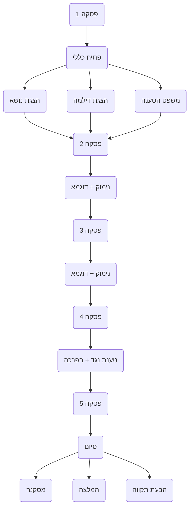

# כתיבת טיעון

### מבנה כתיבת טיעון

```mermaid
graph TB;
A( פסקה 1  ) --> B(פתיח כללי) 
B  --> C(הצגת נושא) --> D(פסקה 2)
B --> C2(הצגת דילמה) --> D
B --> C3(משפט הטענה) --> D

D --> E( נימוק + דוגמא) --> F(פסקה 3)

F --> G(נימוק + דוגמא)


G --> j(פסקה 4)

j --> i(טענת נגד + הפרכה)

i --> k(פסקה 5)

k --> h(סיום)

h --> p(מסקנה)
h --> p2(המלצה)
h --> p3(הבעת תקווה)


```

